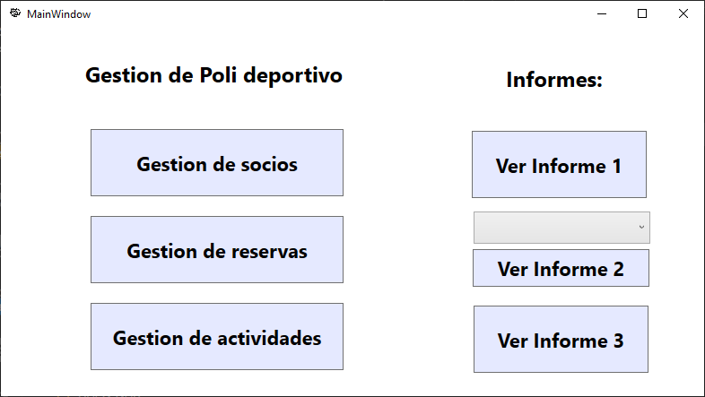
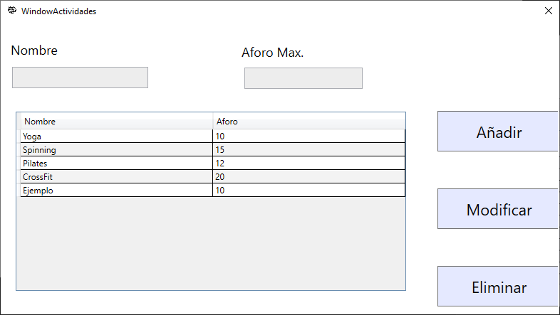
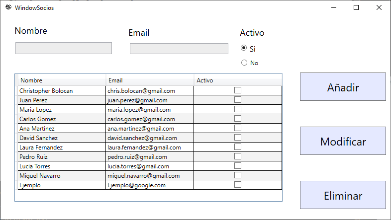
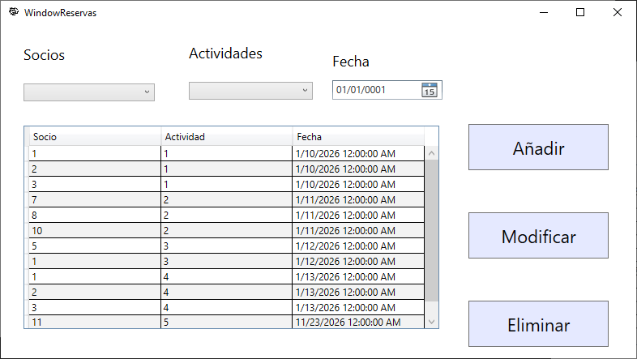

# Centro Deportivo (WPF & MVVM)

## Descripción del proyecto
Esta aplicación se ha desarrollado para poder gestionar un centro deportivo. Permite gestionar los socios , las actividades y las reservas del centro deportivo para así poder facilitar su administración. La aplicación ofrece una interfaz simple e intuitiva. También permite llegar a tres tipos de informes que se generan automáticamente.

---

## Tecnologías usadas
- C#
- .NET Framework
- WPF (Windows Presentation Foundation)
- Patrón MVVM
- SQL Server
- Entity Framework
- Visual Studio

---

## Instalación
1. Clonar el repositorio desde GitHub.
2. Abrir el proyecto con Visual Studio.
3. Revisar la cadena de conexión a la base de datos en el archivo de configuración.
4. Ejecutar el script SQL de creación de la base de datos si es necesario.

---

## Cómo ejecutar
1. Abrir la solución en Visual Studio.
2. Establecer el proyecto principal como proyecto de inicio.
3. Ejecutar la aplicación.

---

## Capturas
La aplicación cuenta con diferentes pantallas como:
- Ventana principal

- Gestión de Actividades

- Gestión de Socios

- Gestión de Reservas

---

## Autores
- Christopher Bolocan  
  Proyecto realizado para el ciclo formativo de Desarrollo de Aplicaciones Multiplataforma (DAM).
